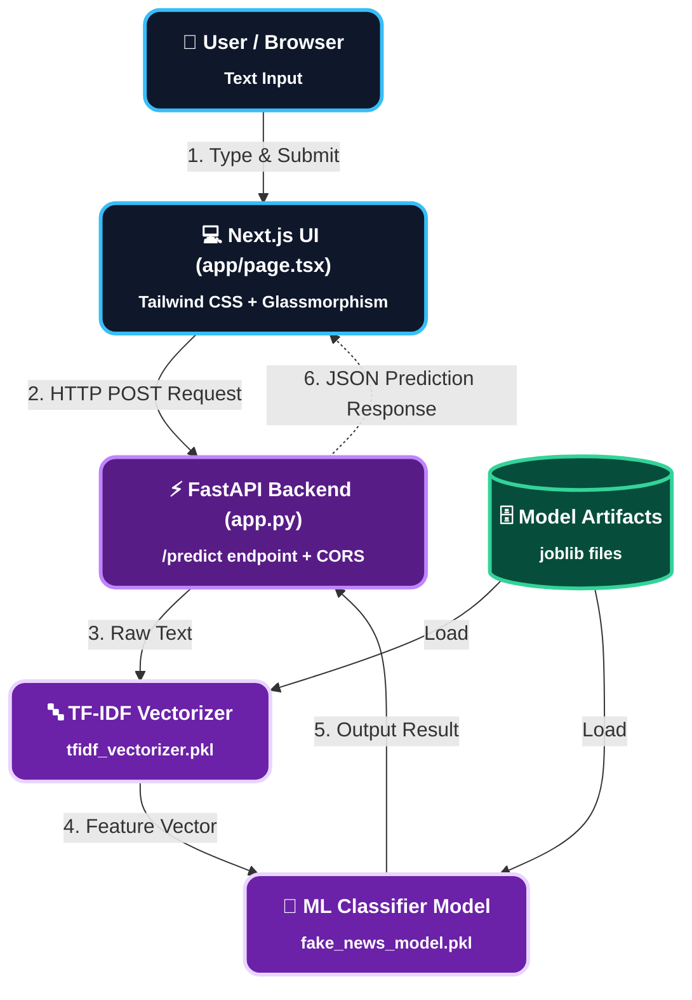

# 📰 Verifi.AI - AI-Powered Fake News Detector

Verifi.AI is a modern full-stack Machine Learning web application that uses Natural Language Processing (NLP) and Machine Learning classifiers to analyze and predict the authenticity (Real vs Fake) of news articles, social media posts, or statements.

---

## 🚀 Features

- **Futuristic UI & Glassmorphism Design:** Built with Next.js 14, Tailwind CSS, Lucide Icons, and dynamic animations in a sleek dark-themed interface.
- **Instant News Verification:** Delivers fast and accurate verdicts using NLP TF-IDF vectorization and an ML classifier.
- **Authenticity Meter & Stats:** Displays a verdict indicator along with a live character and word counter.
- **RESTful Machine Learning API:** Ultra-fast backend service powered by FastAPI with full CORS support.
- **Sample Presets:** Pre-configured test sample buttons for quick, one-click testing.

---
## 📸 Application Preview


## 🏗️ System Architecture

The following visual diagram illustrates the complete flow between the User, Next.js Frontend, FastAPI Backend, and Machine Learning Model Artifacts:




---

## 🛠️ Tech Stack

### **Frontend**
- **Framework:** Next.js (React)
- **Styling:** Tailwind CSS, Glassmorphism UI
- **Icons:** Lucide React

### **Backend**
- **Framework:** FastAPI (Python)
- **Server:** Uvicorn
- **ML & Data Processing:** Scikit-Learn, Joblib, TF-IDF Vectorizer
- **Middleware:** CORSMiddleware, python-multipart

---

## 📁 Project Structure

```text
fake-news-detector/
├── fake-news-backend/
│   ├── app.py                   # FastAPI Application & Endpoints
│   ├── fake_news_model.pkl      # Trained ML Classifier Model
│   ├── tfidf_vectorizer.pkl     # Trained TF-IDF Vectorizer
│   └── requirements.txt         # Python Dependencies
└── fake-news-frontend/
    ├── app/
    │   └── page.tsx             # Next.js UI Main Component
    ├── public/
    └── package.json
```

---

## ⚙️ Installation & Setup

### **1. Backend Setup (FastAPI)**

```bash
# Navigate to backend directory
cd fake-news-backend

# Create virtual environment (Optional but Recommended)
python -m venv venv

# Activate Virtual Environment
# On Windows:
venv\Scripts\activate
# On Mac/Linux:
source venv/bin/activate

# Install dependencies
pip install -r requirements.txt

# Run FastAPI server
uvicorn app:app --reload --port 8000
```
Backend API will be running live at: `https://fake-news-api-fvab.onrender.com/`

---

### **2. Frontend Setup (Next.js)**

```bash
# Navigate to frontend directory
cd fake-news-frontend

# Install packages
npm install

# Run Development Server
npm run dev
```
Frontend will be running live at: `https://fake-news-frontend-wine.vercel.app/`

---

## 🔌 API Endpoint

### `POST /predict`

- **Content-Type:** `application/x-www-form-urlencoded`
- **Body:** `news` (string)

#### **Example Response:**
```json
{
  "prediction": "Real News"
}
```

---

## 🛡️ License

Distributed under the MIT License.
